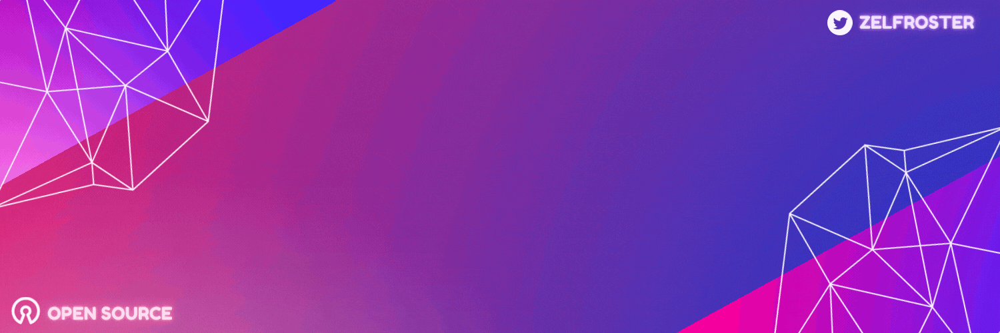

# hi

<!--

-->

<h3>:large_blue_diamond: Languages and Tools</h3>

    
    
    
    
    
   
   
    
    
   

<h3>:large_blue_diamond: Github Stats</h3>

    
      
    

    
### My Holopin Badges

   

<h3>:large_blue_diamond: Reach Me</h3>

    
    

<!---
sumit-kumar-soni/sumit-kumar-soni is a ✨ special ✨ repository because its `README.md` (this file) appears on your GitHub profile.
You can click the Preview link to take a look at your changes.
--->
